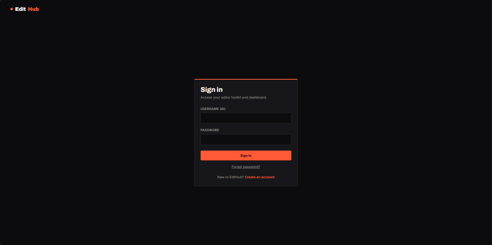
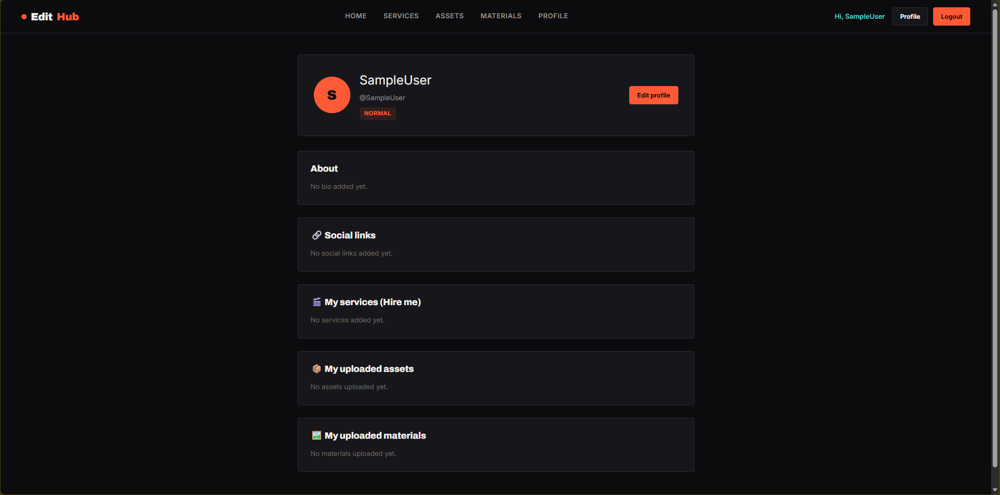
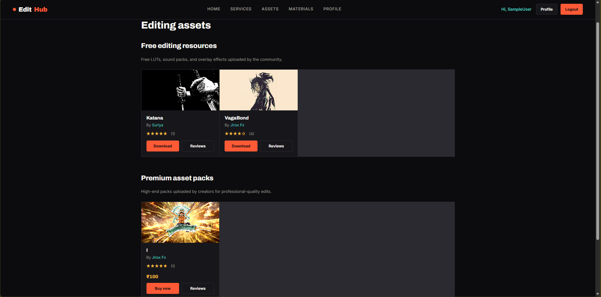
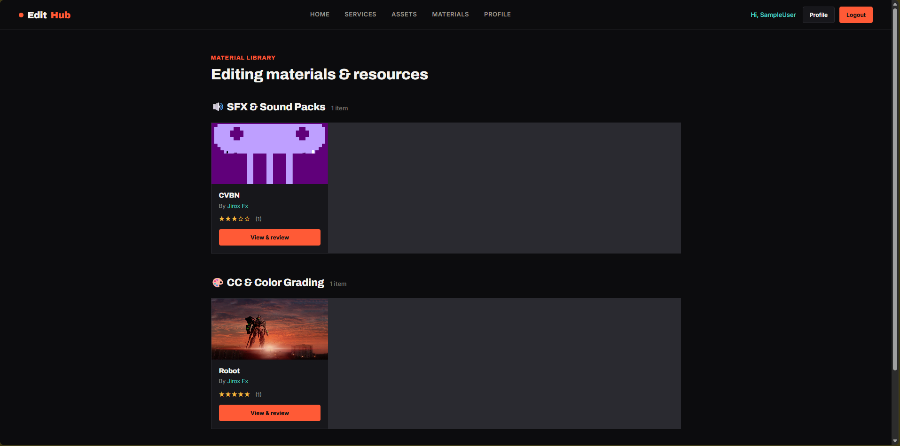

# 🎬 EditHub – Video Editing Services & Asset Marketplace

<p align="center">
  
</p>

<p align="center">
  A platform for Video Editors, Content Creators, Editing Assets, Materials and Professional Editing Services.
</p>

---

## 📌 About The Project

**EditHub – Video Editing Services & Asset Marketplace** is a web-based platform designed for **Video Editors, Content Creators, and Users** who are looking for video editing services and creative resources.

The platform allows users to explore editing assets and materials, hire professional video editors, upload creative resources, manage their profiles, and provide ratings and reviews.

Users can register and choose their category as an **Editor** or **Creator** based on their role.

EditHub aims to create a simple and useful platform where creators and video editors can connect and access everything related to video editing in one place.

---

# ✨ Features

## 👤 User Authentication

- User Registration
- User Login
- Password System
- Logout Functionality
- Password Recovery System
- Recovery Pass Phrase for Account Recovery

---

## 🔐 Recovery Pass Phrase

EditHub includes a **Recovery Pass Phrase** system.

If a user forgets their password, they can use their Recovery Pass Phrase to recover and reset their account credentials.

This provides an additional account recovery option for users.

---

## 🎨 User Categories

Users can select their category based on their role.

Available categories:

- 🎬 Video Editor
- 🎨 Content Creator

---

## 📦 Assets Marketplace

Editors and creators can upload and manage various editing assets.

Users can:

- Browse Assets
- Upload Assets
- Delete Assets
- Explore Editing Resources
- Access Available Assets

Examples of assets include:

- Video Editing Presets
- Templates
- Overlays
- Effects
- Transitions
- Graphics
- Other Editing Resources

---

## 📁 Materials Section

Users can upload and manage editing materials.

Features include:

- Upload Materials
- Browse Materials
- Delete Materials
- Explore Creative Resources

---

## 💼 Hire Video Editors

Users looking for professional video editing services can browse available editors and their services.

Users can:

- View Editor Profiles
- Check Editor Category
- Explore Available Services
- View Social Media Links
- Contact Editors for Hiring

### 📧 Contact Editor

To hire an editor, users can contact them through the **Email Address provided in the Hire Me / Services section**.

Users can communicate with editors regarding:

- Project Requirements
- Video Editing Services
- Pricing
- Project Duration
- Custom Requirements

---

## ⭐ Ratings & Reviews

EditHub allows users to provide ratings and reviews.

Users can review:

- 📦 Assets
- 📁 Materials
- 🎬 Video Editors

Features include:

- Star Ratings
- User Reviews
- Feedback System

---

## 🔗 Social Media Links

Users can add their social media profiles to their EditHub account.

This helps users connect with editors and creators.

Social links can include:

- YouTube
- Instagram
- LinkedIn
- Twitter / X
- Other Platforms

Users can also manage and update their social media links.

---

## 👤 User Profile

Users can manage and update their profile.

Features include:

- Update Profile Information
- Select User Category
- Add Social Media Links
- Manage Uploaded Assets
- Manage Uploaded Materials
- Add Services
- View Reviews
- Manage Account Information

---

# 🛠️ Technologies Used

## Frontend

- HTML5
- CSS3
- JavaScript

## Backend

- PHP

## Database

- MySQL

## Server Environment

- XAMPP
- Apache Server

---

# 📂 Project Structure

```text
EditHub/
│
├── css/
│   └── style.css
│
├── js/
│   └── script.js
│
├── php/
│   ├── asset_add.php
│   ├── asset_delete.php
│   ├── db.php
│   ├── login_process.php
│   ├── logout.php
│   ├── material_add.php
│   ├── material_delete.php
│   ├── navbar.php
│   ├── profile_review_add.php
│   ├── register_process.php
│   ├── reset_process.php
│   ├── review_add.php
│   ├── review_delete.php
│   ├── service_add.php
│   ├── service_delete.php
│   ├── social_link_add.php
│   ├── social_link_delete.php
│   └── social_link_update.php
│
├── sql/
│   └── profile_update.sql
│
├── uploads/
│   ├── assets/
│   └── materials/
│
├── admin.php
├── assets.php
├── edit_profile.php
├── home.php
├── index.php
├── login.php
├── materials.php
├── profile.php
├── register.php
├── reset.php
├── review.php
├── search.php
├── services.php
├── view_profile.php
│
└── README.md
```

---

# 📸 Project Screenshots

Add your website screenshots inside an `images` folder.

## 🏠 Home Page


---

## 🔐 Login Page



---

## 📝 Registration Page


---

## 🔑 Password Recovery Page


---

## 👤 User Profile



---

## 📦 Assets Page



---

## 📁 Materials Page



---

## 💼 Services / Hire Editor


---

## ⭐ Reviews & Ratings


---

# ⚙️ Installation Guide

Follow the steps below to run the project locally.

## 1️⃣ Install XAMPP

Download and install XAMPP.

Start the following services:

- Apache
- MySQL

---

## 2️⃣ Clone the Repository

```bash
git clone https://github.com/YOUR-USERNAME/EditHub.git
```

---

## 3️⃣ Move Project to XAMPP

Move the project folder to:

```text
C:\xampp\htdocs\
```

Example:

```text
C:\xampp\htdocs\EditHub
```

---

## 4️⃣ Create Database

Open phpMyAdmin:

```text
http://localhost/phpmyadmin
```

Create a database named:

```text
edithub
```

---

## 5️⃣ Import SQL File

Import the SQL file available in the project.

```text
sql/profile_update.sql
```

Make sure the database configuration in:

```text
php/db.php
```

matches your MySQL credentials.

Example:

```php
$host = "localhost";
$username = "root";
$password = "";
$database = "edithub";
```

---

## 6️⃣ Create Upload Folders

Make sure the following folders exist:

```text
uploads/assets/
uploads/materials/
```

Ensure that the folders have proper write permissions.

---

## 7️⃣ Run The Project

Open your browser and visit:

```text
http://localhost/EditHub/
```

---

# 🔐 Main Features Summary

| Feature | Description |
|---|---|
| 👤 User Authentication | Register, Login and Logout |
| 🔑 Recovery Pass Phrase | Account Recovery System |
| 🎬 Editor Category | Users can become Video Editors |
| 🎨 Creator Category | Users can become Content Creators |
| 📦 Assets | Upload and Manage Editing Assets |
| 📁 Materials | Upload and Manage Editing Materials |
| 💼 Services | Editors can provide their services |
| 📧 Hire Editor | Contact Editors through Email |
| ⭐ Reviews | Rate and Review Assets, Materials and Editors |
| 🔗 Social Links | Add Social Media Profiles |
| 👤 Profile | Manage User Information and Content |

---

# 🎯 Project Objectives

The main objective of EditHub is to create a platform where:

- Video Editors can showcase their services.
- Content Creators can find professional editors.
- Users can access editing assets.
- Users can upload editing materials.
- Creators and Editors can connect.
- Users can provide ratings and reviews.
- Editors can promote their social media profiles.
- Users can find creative resources in one place.

---

# 🚀 Future Improvements

Some future features that can be added to EditHub include:

- 💳 Online Payment Gateway
- 📥 Asset Download System
- 💬 Real-Time Chat System
- 🔔 Notification System
- ❤️ Favourite Assets
- 🔍 Advanced Search and Filters
- 📊 User Dashboard
- 📱 Fully Responsive Mobile Design
- 🤖 AI-Based Editor Recommendation
- 📈 Editor Analytics Dashboard
- 🛒 Complete Marketplace System
- 👑 Premium Asset System
- 📧 Automated Email System

---

# 👨‍💻 Author

**Jeyasuriya**

Developer of **EditHub – Video Editing Services & Asset Marketplace**

---

# 📄 License

This project is created for educational and learning purposes.

---

## ⚠️ Disclaimer

EditHub is a personal and educational project developed for learning, demonstration, and academic purposes.

The assets, materials, images, logos, and other content uploaded by users are the responsibility of their respective owners.

The developer of EditHub does not claim ownership of any third-party assets, materials, trademarks, logos, images, or content uploaded or shared by users on the platform.

Users are responsible for ensuring that the content they upload, share, or use on the platform does not violate any copyright, intellectual property rights, or other legal regulations.

This project is not intended to promote copyright infringement, piracy, or unauthorized distribution of copyrighted materials.

Any user-uploaded content remains the responsibility of the respective user or content owner.

---
